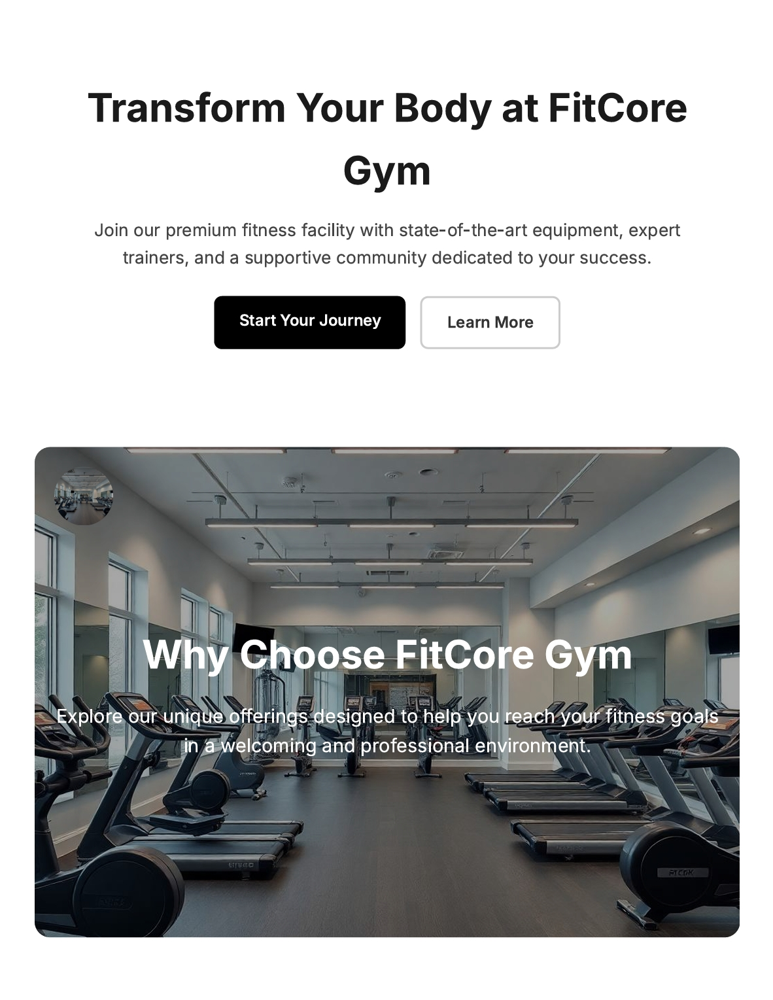
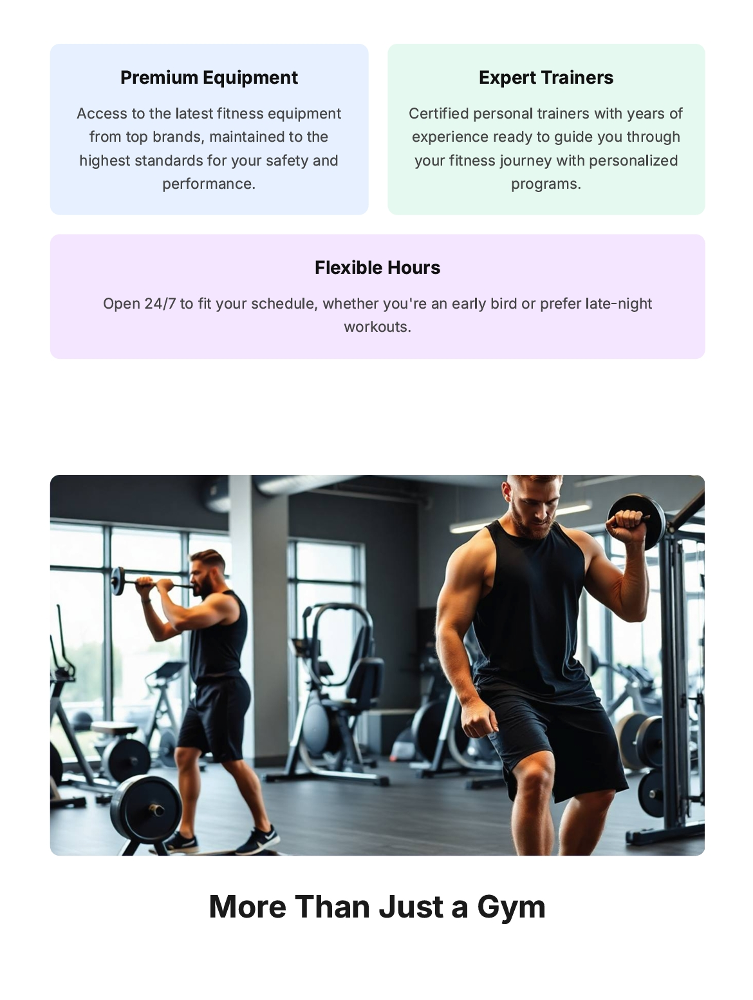
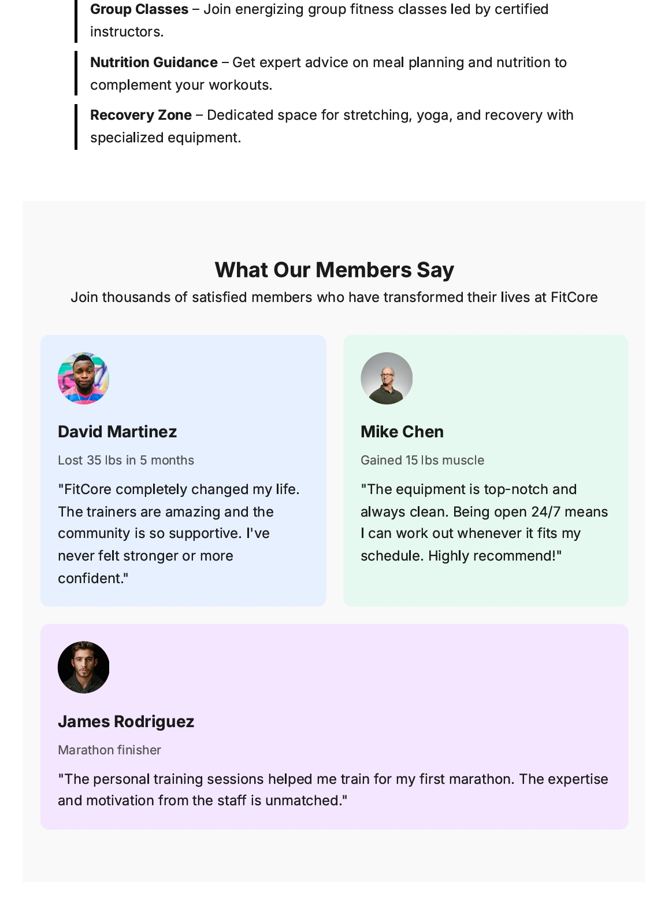
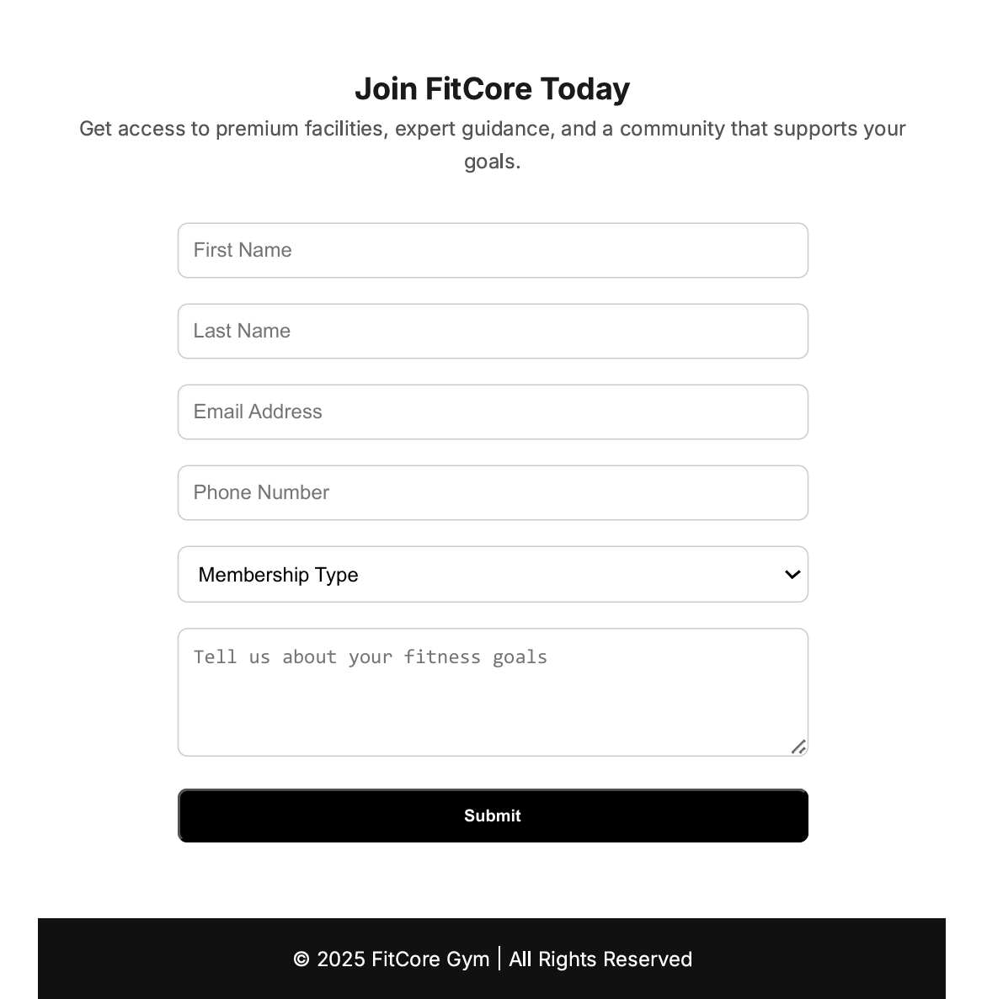

## FitCore Gym — Modern Fitness Landing Page

FitCore Gym is a modern, fully responsive landing page designed to showcase a premium fitness facility.
The project highlights clean UI structure, organized content flow, and strong front-end styling skills using only HTML and CSS.

The goal of this concept project is to simulate a high-quality marketing page for a gym brand—focusing on visual clarity, user engagement, and a seamless layout experience without using JavaScript or frameworks.

## Project Overview

FitCore Gym is built as a structured single-page website that follows a real-world fitness landing page flow.
It provides clear navigation, strong visual elements, and compelling calls to action designed to attract potential gym members.

## Project Preview

## The page includes:

 • A bold hero section introducing the brand message
 • A full-width “Why Choose Us” banner card
 • Highlighted features of the gym
 • A “More Than Just a Gym” lifestyle section
 • Member testimonials for credibility
 • A membership form designed to simulate user lead capture

This project focuses on user experience, readability, and layout consistency.

## Key Features

 • Responsive Landing Page
Adapted for mobile, tablet, and desktop using flexible CSS layouts.
 • Strong Visual Hierarchy
Clear headings, well-balanced spacing, and consistent typography.
 • Hero Section with Calls to Action
Encourages users to start their membership journey immediately.
 • Image Banner with Overlayed Text
Presents the gym’s core value in a visually compelling way.
 • Feature Highlight Boxes
Distinct color-coded sections to emphasize major selling points: equipment, trainers, and 24/7 hours.
 • Lifestyle Section
Extends the brand by showcasing group classes, nutrition support, and recovery zones.
 • Testimonial Cards
Social proof presented through member transformation stories.
 • Membership Form
Functional structure for collecting user information and membership type.
 • Built Without JavaScript
A demonstration of pure HTML and CSS capability in creating dynamic-feeling marketing pages.

## Technologies Used

 • HTML5 — Semantic structure and accessible layout
 • CSS3 — Responsive styling, grid systems, colors, and component design
 • Google Fonts (Inter) — Modern, readable typography

## What This Project Demonstrates

 • Ability to design a complete marketing landing page from scratch
 • Strong understanding of layout design, branding alignment, and content flow
 • Experience building responsive UIs using modern CSS techniques
 • Skill in translating business goals into structured, user-friendly sections
 • Capability to create visual impact without relying on interactivity or scripts

FitCore Gym shows practical front-end design ability suitable for real-world client landing pages.

## Developer

Teef M. Karyry — TeefDev
